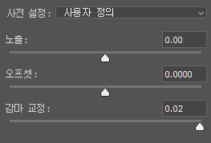
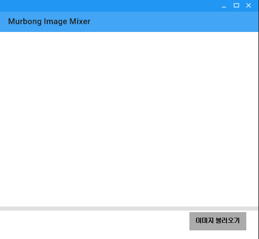
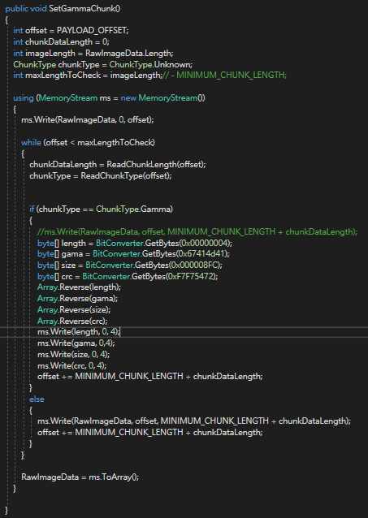
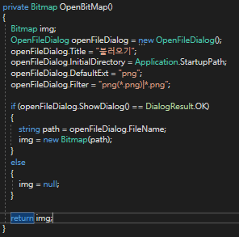
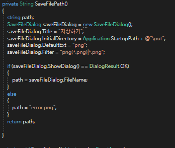
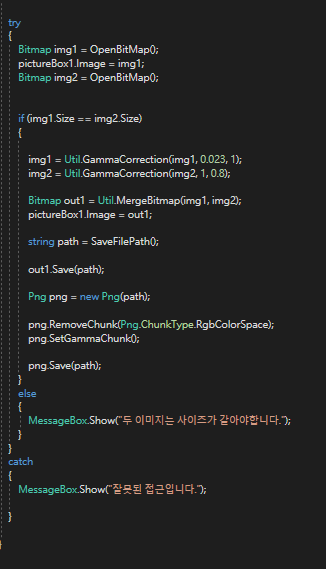
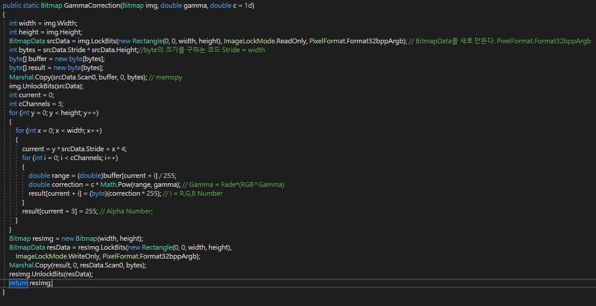
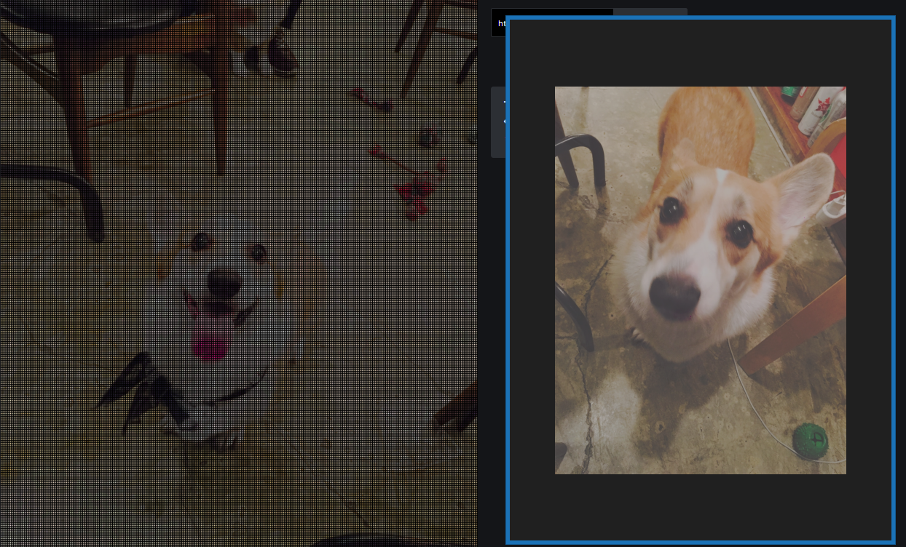

# #Image Mixer

> 프로그램 종류 : GUI, 이미지 처리, 자동화, 
>
> 사용 언어 : C#
>
> 사용 라이브러리 : MaterialSkin
>
> 프로젝트 소스 링크 : https://github.com/murbong/MurbongImageMix

## 설명

> Image Mixer가 대체 뭐하는거에요?

구글링을 하던 도중 신기한 이미지를 보았다.

이 이미지는 저장하거나 다른 이미지 뷰어로 볼 시, 이미지가 달라진다.

처음에는 Png 투명도를 이용한건가 했더니 아니다. 그래서 포토샵 키고 온갖 짓을 다 해봤다. 그랬더니

감마 0.02 부근대에서 이 이미지가 나오고, 감마 1에서는 다른 이미지가 나온다.

여기서 유추해볼 것은, 

> 감마 1에서 이미지 사이의 흰 점이 감마 0.02 부근의 이미지이고, 감마 0.02의 검은점이 감마1의 이미지이다.

라는 것이다.

그런데, 어떻게 웹 상에서는 감마 0.02의 그림이 나올까?

> https://en.wikipedia.org/wiki/Gamma_correction](http://en.wikipedia.org/wiki/Gamma_correction) 참조
>
> The PNG specification defines the gAMA chunk (the chunk that stores the gamma value) to change the image output like so:
>
> light_out = image_sample^(1 / gamma)
>
> This scales the image values exponentially based on the reciprocal of the gamma value. If the gamma value is around 1 like it normally is this function has little noticeable effect. During this process, the lowest brightness value for a pixel is 0 and the highest is 1.
>
> If we set the PNG gamma attribute to a very low value, making the exponent value very high (since it is the reciprocal), all darker pixels will be made black and all lighter pixels will be mapped to the normal spectrum.

PNG 파일의 gAMA 헤더가 이미지의 감마를 보정하고 있다. 그런데 이 헤더가 인식되는 곳이 있고, 안되는 곳이 있어서 생긴 일이다.

이 정보를 토대로 자동 Image Mix 프로그램을 만든 것이 Image Mixer이다.

### Image Mixer GUI

> UI가 너무 구리다고 다른 라이브러리를 설치해 보았다.

GUI는 매우 간단하다. 중앙의 PictureBox, 그리고 이미지 불러오기 버튼 하나. 끝이다.

이미지 불러오기는 총 3번의 작업을 하는데, 1번 이미지 불러오기, 2번 이미지 불러오기, 저장하기 작업을 한다.

두 이미지의 크기는 같아야 한다. 같지 않다면 코드를 실행하지 않는다.

## 소스 코드

> https://github.com/VashSan/png-chunk-stripper / Png 헤더 청크를 지우는 소스코드. 이것을 변형하면 지우는것이 아닌 추가도 할 수 있지 않을까?

Png Chunk stripper를 변형해 만든 SetGammaChunk 메소드이다.

Png 파일 구조를 읽은 뒤, gAMA 헤더가 있는 부분을 본인이 직접 하드코딩하여 0.023이라는 청크 값을 넣었다.

이미지를 불러오는 작업이 중복되므로, Bitmap을 리턴하는 메소드를 생성했다.

세이브를 할 땐 문자열 Path를 리턴하는 메소드를 생성했다.

버튼을 누를 시 모든 과정을 수행한다. 일단 이미지 1은 웹에서 보이는 이미지, 2는 그렇지 않은 이미지이다.

그래서 첫 이미지의 감마를 0.023 보정한다. 이때 사용되는 수식은 이러하다.
$$
GammaRGB = RGB^{gamma}
$$
이미지 감마 보정과 이미지 병합을 처리하는 데 사용된것은 setPixel이 아닌 Lockbits가 사용되었다.

> Lockbits를 사용한 이유? setPixel보다 빠르기 때문.
>
> https://mfranc.com/programming/operacje-na-bitmapkach-net-1/
>
> 퍼포먼스 테스트에서 반복 작업 시  Lockbits가 거의 7배 빠르다.

### 감마 보정

BitmapData를 현재 이미지 크기로 생성한 뒤, 현재 이미지를 srcData 객체에 메모리 고정한다.

그 다음 buffer에 srcData의 주소에서 이미지 크기까지의 메모리를 복사한다.

buffer에 쓰기 완료 되었으니 이미지를 언락한다.

이중 for문을 돌려, 픽셀 하나하나씩 감마를 보정한다. 이 때 x*4를 하는 이유는, 한 픽셀이 RGBA의 4가지 바이트를 사용하기 때문이다.

이제 리턴할 Bitmap을 생성해, BitmapData에 result 버퍼를 복사한다.

### 이미지 병합

이미지를 불러오는 방법은 전과 동일하다.하지만 이번엔 이미지가 2개이니 버퍼도 2개. 또한 result의 크기는  이미지 크기의 4배이다 (가로 세로 2배씩)

그러므로 작은 이미지의 current는 큰 이미지보다 2배 작아야한다.

만약 x,y가 짝수이면 첫번째 이미지 픽셀을 삽입하고, 아니면 두번째 이미지 픽셀을 삽입한다.

그런다음 result 이미지를 리턴한다.

### 감마 헤더 설정

Png 헤더에 sRGB, 즉 RgbColorSpace가 있다면, Gamma Header는 무시된다. 고로 sRGB헤더를 지워 Gamma 헤더를 활성화 시킨뒤, 감마 청크를 재설정한다.

이제 모든 처리가 끝났으므로 이미지를 저장한다.

## 예시

[우리집 개사진](https://i.imgur.com/iQHGxVY.png)

GammaChunk를 지원하는 플랫폼인 imgur.com에 이미지 몇개를 올려보았다.

저장하거나 썸네일로 보면 무표정의 개가, 들어가서 보면 웃는 개 사진이 나온다.

> 요렇게!

만약 GammaChunk를 지원하지 않는 웹사이트에서 이미지를 보여주고 싶다면, 지원하는 사이트에 올린 뒤, 이미지 주소를 복사하여 html 태그 img를 사용하면 된다.

